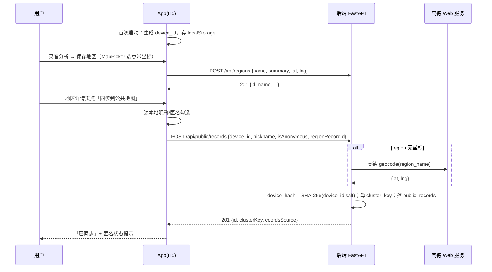
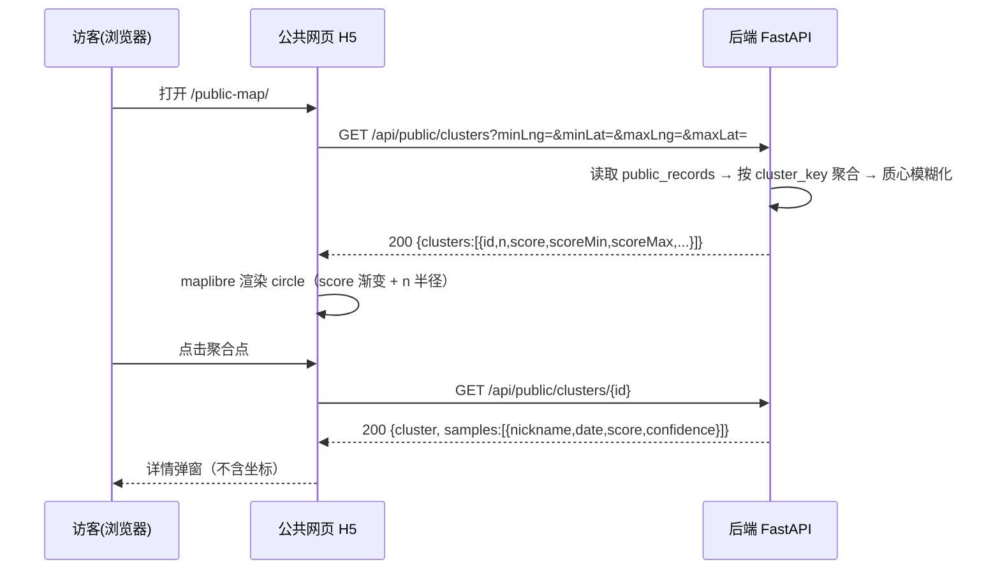

# 《林间回响》公共地图（城市鸟类宜居度）技术架构方案与任务分解

> 版本：v2.0（2026-08-18 用户决策后修订；v2 与 v1 冲突处**以 v2 为准**）
> 作者：高见远（架构）→ 主理人按用户直接决策修订
> 依据：PM 需求分析结论 + 主理人核实现状 + 用户 2026-08-18 拍板

---

## v2 修订说明（用户 2026-08-18 决策）

1. **数据本地化**（新增，替代"云端全局共享"前提）：单次/批量分析结果**保存在手机本地**（WebView localStorage），App 升级不丢（localStorage 随 APK 升级保留，卸载才清）。识别计算仍云端（BirdNET 在后端，音频照传，结果落本地）。实测 detail_json 平均 3.7KB → localStorage 5MB 可存 1000+ 条。
2. **登录系统**（新增，替代 v1 的匿名 device_id）：开屏注册/登录，**用户名+密码**（无手机号/邮箱）。用户名唯一；密码哈希用标准库 `hashlib.pbkdf2_hmac`（无新依赖）；登录返回 token（服务端 token 表，长期有效）；**不提供找回**（用户名被占可注册新号）。
3. **身份模型**：`public_records` 挂 `user_id`（NOT NULL，登录后才可上传）+ `username` 快照 + `is_anonymous`。**匿名 = 上传时不显示用户名**（记录仍归属 user_id，可管理/撤回）。
4. **上传语义**：上传的是**本地地区记录**（region 当前快照：name/lat/lng/score/confidence/summary_json），一次上传=一条公共记录；云端不再需要 region_records 存储（本地化后 App 不调云端 /api/regions 存数据，保留接口兼容）。
5. **署名方式**：在**设置页**设定默认（用户名 / 匿名），上传时不再询问。
6. **公共网页**：独立 Vite + maplibre + 高德栅格瓦片（无 key），独立托管，CORS 跨域直连后端（用户已确认独立托管）。
7. 坐标来源：App 保存地区时记录选点坐标（GCJ-02）；无坐标时后端 geocode 反查兜底（coords_source 标注）。
8. **隐私边界**：公共只显示 用户名或"匿名用户" + 日期（到天）；坐标对外模糊 ±250m（JITTER_DEG=0.0025）；撤回=物理删除，仅 user_id 匹配者可删。

（以下 v1 内容与 v2 冲突处以 v2 为准，尤其 §3.1 的 region_records 改造、§6 的 device_hash、§4.1 的上传请求字段。）

---

## 1. 实现方案总览

### 1.1 需求本质与对应模块

| 需求 | 模块 | 关键决策 |
|---|---|---|
| 匿名身份隔离 | 身份模块 | 本地 `device_id`（UUID）+ 服务端只存 `SHA-256` 哈希；不做账号体系 |
| 手动"同步到公共地图" | 后端 API + App 端 | 新增 `public_records` 表，App 在"地区详情"页提供公开入口 |
| 经纬度采集 | App 端 + 数据模型 | `region_records` 加 `lat/lng` 列；保存地区时随坐标提交 |
| 公共上传池 | 后端 API + 数据模型 | 新增 `public_records` 表（含聚合冗余列） |
| 公共聚合展示网页 | 公共网页 H5 | 独立 Vite 项目 + maplibre + 高德栅格瓦片（**不用高德 JS API**） |

### 1.2 模块划分与新增/改动范围

```
┌─────────────┐    ┌────────────────────────────┐    ┌─────────────────┐
│  App(H5)     │───▶│ 后端 FastAPI (Sealos)        │    │ 公共网页 H5      │
│  - device_id │    │  - 身份: device_hash         │    │  - 只读公共聚合  │
│  - 昵称      │    │  - 公共池: public_records    │    │  - maplibre 地图 │
│  - 坐标采集  │    │  - 聚合引擎: 查询时聚合       │    │  - 详情弹窗      │
│  - 公开入口  │    │  - geocode 兜底(复用)         │    │                 │
└──────┬──────┘    └─────────────┬──────────────┘    └────────┬────────┘
       │                         │ 静态挂载 dist/             │
       │                         └──────────────┬─────────────┘
     WebView                       GET /api/public/*（同源或 CORS）
```

### 1.3 框架选型评估与推荐

**① 公共网页：独立 Vite H5 项目（推荐）vs 并入现有前端**

| 方案 | 优点 | 缺点 |
|---|---|---|
| **独立 Vite H5**（`linjianhuixiang-app/public-map/`） | ① 公共网页无需重打包 APK；② 不污染 App 主 bundle；③ 可独立部署到任意静态托管 | 多维护一个 package；与 App 前端少量代码重复（坐标工具、配色） |
| 并入现有前端（加路由） | 零新项目 | ① 每次改动都要重打包 APK；② 公共网页代码打进 App 无意义；③ 部署耦合 |

**推荐：独立 Vite H5 项目**，构建产物挂到后端 FastAPI 静态目录（`/public-map/`），与 Sealos 后端**同源部署**，免 CORS、复用既有部署链路。后续若要独立托管，后端 CORS 已是 `*`，零改动即可切换。

**② 地图引擎：复用 maplibre + 高德栅格瓦片（推荐）vs 高德 JS API**

| 方案 | key 需求 | 说明 |
|---|---|---|
| **maplibre + 高德栅格瓦片**（现有方案，`webrd0N.is.autonavi.com` 无 key） | 无 | 公共地图只需要"自有数据点 + 弹窗"，maplibre 完全胜任；聚合点是 GCJ-02，与高德栅格瓦片坐标系一致，直用 `mapUtils.js` 的坐标工具 |
| 高德 JS API 2.0 | **必须在浏览器端明文暴露 key**，且新 key 强制配"安全密钥"(jscode)，需服务端代理 jscode | 无法走后端普通代理；受域名白名单限制；对纯数据展示是过度设计 |

**推荐：复用现有 maplibre + 高德栅格瓦片**。`key 保持后端代理`的原则不变（JS API 的 key 天然只能在浏览器端，因此本方案从源头绕开）。仅当未来需要"行政区划边界/高德 POI 检索"时再评估 JS API（P2+，见 §12 风险 2）。

---

## 2. 文件清单

### 2.1 后端（`backend/`）

| 文件 | 操作 | 用途 |
|---|---|---|
| `app/config.py` | 修改 | 新增 `DEVICE_SALT`、聚合常量（`CELL_DEG`/`JITTER_DEG`/`CONF_EPS`） |
| `app/core/privacy.py` | **新增** | `device_hash()`、坐标格网 `cluster_key()`、质心模糊 `fuzz_point()`、聚合函数 `aggregate_clusters()` |
| `app/db/database.py` | 修改 | `_init_schema` 幂等迁移：`region_records` 加列 + `public_records` 建表；新增 5 个方法（上传/查询/详情/我的/撤回） |
| `app/api/schemas.py` | 修改 | 新增 `PublicRecordCreate`、`ClusterItem`、`ClusterDetail`、`MyPublicRecord` 等 Pydantic 模型 |
| `app/api/routes.py` | 修改 | 新增 `/api/public/*` 路由；`POST /api/regions` 支持可选 `lat/lng` |
| `tests/test_db.py` | 修改 | 迁移幂等性 + 新表 CRUD |
| `tests/test_public.py` | **新增** | 上传/聚合/撤回/权限 接口测试 |
| `tests/test_privacy.py` | **新增** | 哈希一致性、格网划分、坐标模糊、加权均值公式 |

### 2.2 前端 App（`linjianhuixiang-app/frontend/`）

| 文件 | 操作 | 用途 |
|---|---|---|
| `src/utils/device.js` | **新增** | `device_id` 生成/读取（localStorage `ljx_device_id`）、昵称读写 |
| `src/services/apiService.js` | 修改 | 新增 `uploadPublicRecord` / `getPublicClusters` / `getMyPublicRecords` / `withdrawPublicRecord`；`saveRegion` 增加坐标参数 |
| `src/store/appStore.jsx` | 修改 | 挂载 device_id/nickname state 与 actions |
| `src/screens/RegionScreen.jsx` / `RegionSummary.jsx` | 修改 | 保存地区时携带坐标；"同步到公共地图"入口 + 匿名勾选 + 结果反馈 |
| `src/screens/SettingsScreen.jsx` | 修改 | 昵称设置；"我的公开记录 + 撤回"列表页入口 |
| `src/screens/MyPublicScreen.jsx` | **新增** | 我的公开记录列表 + 撤回 |
| `src/components/map/MapPicker.jsx` | 修改（小） | 选点完成时把坐标回调给上层（若当前未暴露） |
| `src/utils/mapUtils.js` | 不改 | 复用 `scoreToColor`/`gcj02ToWgs84` 等 |

### 2.3 公共网页（`linjianhuixiang-app/public-map/`，全新项目）

| 文件 | 用途 |
|---|---|
| `package.json` / `vite.config.js` / `index.html` | 独立构建（base=`/public-map/`） |
| `src/main.jsx` / `src/App.jsx` | 入口 + 页面骨架（地图 + 筛选条 + 详情弹窗） |
| `src/api.js` | 后端 `GET /api/public/clusters` 封装 |
| `src/map.js` | maplibre 初始化（高德栅格瓦片）、聚合点渲染、点击弹窗 |
| `src/colors.js` | 聚合色（P0 复用 `COLOR_STOPS` 渐变；P1 差异化） |
| `src/styles.css` | 简约样式（不引 Tailwind，减小体积） |

构建产物输出到 `backend/app/static/public-map/`（由 FastAPI `StaticFiles` 挂载，见 2.1 之外主工程改动：`backend/app/main.py` 增加静态目录挂载）。

### 2.4 测试

后端 pytest 见 2.1；公共网页暂不设单测（P1 视需要补 `vitest`）。前端 App 现有 `tests/` 沿用 node --test，新增 `tests/device.test.mjs`。

---

## 3. 数据模型设计

### 3.1 `region_records` 改造（幂等迁移）

```sql
-- 兼容旧库：try/except 幂等，与现有 history.detail_json 迁移写法一致
ALTER TABLE region_records ADD COLUMN lat REAL;         -- GCJ-02 经度；旧数据为 NULL
ALTER TABLE region_records ADD COLUMN lng REAL;         -- GCJ-02 纬度；旧数据为 NULL
ALTER TABLE region_records ADD COLUMN device_hash TEXT; -- SHA-256(device_id:salt)；旧数据为 NULL(legacy)
```

- `lat/lng` 为显式冗余列：数据源 = 用户在地图上选点/选地区的结果（GCJ-02，与瓦片一致）；GPS 原始点在前端先过 `wgs84ToGcj02`。
- 旧行 `lat/lng` 为 NULL：公开上传时后端用 `region_name` 调 `/api/geocode` 同款高德接口反查兜底。
- **`device_hash` 为 NULL 的旧记录视为 legacy**，可直接公开（历史数据所有权无法追溯），但**不可撤回**（见 §6.4）。

### 3.2 `public_records` 表（公共上传池）

```sql
CREATE TABLE IF NOT EXISTS public_records (
    id            INTEGER PRIMARY KEY AUTOINCREMENT,
    device_hash   TEXT NOT NULL,                       -- 谁上传的（只存哈希）
    nickname      TEXT,                                -- 公开昵称；is_anonymous=1 时为 NULL
    is_anonymous  INTEGER NOT NULL DEFAULT 0,
    region_name   TEXT NOT NULL,                       -- 地区名（快照，不受后续重命名影响）
    lat           REAL NOT NULL,                       -- 原始坐标（GCJ-02，服务端内部）
    lng           REAL NOT NULL,                       -- 仅在对外输出时做模糊化
    cluster_key   TEXT NOT NULL,                       -- "region_name|cellLat:cellLng"，写库时算好
    score         INTEGER NOT NULL CHECK(score BETWEEN 0 AND 100),
    confidence    REAL    NOT NULL DEFAULT 0 CHECK(confidence BETWEEN 0 AND 1),
    coords_source TEXT    NOT NULL DEFAULT 'manual',   -- manual|gps|geocode|missing
    summary_json  TEXT NOT NULL,                       -- 完整摘要快照（详情弹窗用）
    created_at    TEXT NOT NULL                        -- ISO 8601 UTC，秒级（同现有 _now()）
);
CREATE INDEX IF NOT EXISTS idx_public_cluster_key ON public_records(cluster_key);
CREATE INDEX IF NOT EXISTS idx_public_device_hash ON public_records(device_hash);
CREATE INDEX IF NOT EXISTS idx_public_created_at  ON public_records(created_at);
```

设计要点：
- **存储原始坐标，对外接口输出模糊坐标**。聚合精度与隐私可兼得——数据库在可信云端，只有 API 输出层做脱敏。
- `cluster_key` 是冗余列而非缓存表：写入时算好，查询按它 GROUP BY + 建索引，聚合在毫秒级完成。
- `summary_json` 存完整摘要快照（与 `region_records.detail_json` 同源），保证详情弹窗不依赖原记录是否被删。

### 3.3 是否建聚合缓存表 —— **不建**

理由：样本量预期 ≤ 数千条，SQLite 每次请求做内存聚合（读 `public_records` 全表 → Python 分组 → 计算）在毫秒级；实时聚合保证"撤回/新上传"立即可见，无缓存一致性问题。仅当单簇样本 > 500 或请求量明显上升时，再考虑物化 `cluster_cache`（P2，见 §12 风险 8）。

---

## 4. 接口设计

> 约定：响应字段沿用现有 camelCase 契约；时间一律 ISO 8601 UTC；错误统一 `{"error": "...", "detail": "..."}`。

### 4.1 公开上传

**`POST /api/public/records`**（公开池写入；`region_record_id` 方案，服务端负责组装与兜底）

请求：
```json
{
  "deviceHash": "a1b2...",                 // 必填，前端哈希后提交（见 §6.2）
  "nickname": "绿荫观察员",                 // 可选；isAnonymous=true 时忽略并置 NULL
  "isAnonymous": false,                    // 默认 false
  "regionRecordId": 12,                    // 必填，读取 region_records 组装数据
  "overrideCoords": { "lat": 30.259, "lng": 120.132 }  // 可选；覆盖 region 记录的坐标
}
```
响应 `201`：
```json
{
  "id": 88, "regionName": "西湖公园",
  "score": 72, "confidence": 0.85,
  "coordsSource": "manual",                 // manual | gps | geocode | missing
  "clusterKey": "西湖公园|2338:2404",
  "createdAt": "2026-08-18T09:30:00+00:00"
}
```
错误：`404` region 记录不存在；`400` 无坐标且 geocode 反查失败（前端提示"无法自动定位，请在地图上选点"，此时允许 `overrideCoords` 或放弃）。

后端组装逻辑：`regionRecordId` → `region_records` → `lat/lng`（缺失则 `overrideCoords` → geocode 反查 `region_name`）→ `score/confidence` 从 `detail_json.livability` 提取 → 算 `cluster_key` → 落库。

### 4.2 公共聚合查询

**`GET /api/public/clusters`**（公共网页主数据源；可无参=全量）

Query 参数：
| 参数 | 类型 | 说明 |
|---|---|---|
| `minLng/maxLng/minLat/maxLat` | float | 视口矩形（可选，缺省=全量） |
| `region` | string | 地区名筛选（P1） |
| `minScore/maxScore` | int | 评分区间（P1） |
| `from/to` | string | ISO 时间窗（P1） |
| `limit` | int | 默认 200，上限 500 |

响应 `200`：
```json
{
  "clusters": [
    {
      "id": "西湖公园|2338:2404",           // 即 cluster_key，详情接口用
      "regionName": "西湖公园",
      "lat": 30.259, "lng": 120.132,        // 质心 + 确定性模糊偏移（GCJ-02）
      "n": 6,                               // 样本数 N
      "score": 73.2,                        // 置信度加权均值，1 位小数
      "scoreMin": 61, "scoreMax": 85,       // 最高/最低区间
      "confidenceAvg": 0.78,                // 置信度均值，2 位小数
      "createdFrom": "2026-08-01",          // 簇内最早/最晚日期（到天）
      "createdTo": "2026-08-18"
    }
  ],
  "total": 42
}
```

### 4.3 聚合点详情

**`GET /api/public/clusters/{cluster_key}`**（点击弹窗）

响应 `200`：
```json
{
  "cluster": { /* 同 4.2 单条 */ },
  "samples": [
    {
      "nickname": "匿名用户",                // is_anonymous 或无昵称 → "匿名用户"
      "isAnonymous": true,
      "date": "2026-08-15",                 // 到天，不精确到时分
      "score": 78, "confidence": 0.9,
      "summary": { "livability": { "score": 78, "noise": 20 } }  // 次要摘要信息
    }
  ]
}
```
**样本不返回任何坐标**（模糊坐标也返回），彻底避免从样本反推精确位置。

### 4.4 我的公开记录 + 撤回

**`GET /api/public/me?deviceHash=...`**
```json
{ "records": [
  { "id": 88, "regionName": "西湖公园", "score": 72, "createdAt": "2026-08-18T09:30:00+00:00", "isAnonymous": false, "nickname": "绿荫观察员" }
] }
```

**`DELETE /api/public/records/{id}?deviceHash=...`** → `200 {"ok": true, "id": 88}`
- 校验 `device_hash` 匹配才可删；不匹配 → `403`；不存在 → `404`。
- 撤回 = **物理删除**（无软删），聚合即时变化。

### 4.5 与现有 `/api/regions` 的兼容

- 现有端点**全部不动**；`POST /api/regions` 请求体扩展可选 `lat/lng`（Pydantic 可选字段，向后兼容），`saveRegion` 前端函数签名扩展第三参 `coords`。
- `region_records` 新增列对旧行自动 NULL，`GET /api/regions` 响应**不新增字段**（避免破坏前端契约测试 `dataContract.test.js`）；`public_records` 完全独立。

### 4.6 昵称设置 —— 无独立 API

昵称是**本地设置**（localStorage `ljx_nickname`），随每次上传快照进 `public_records.nickname`。不建 profile 表、不做服务端全局昵称——避免向账号体系倾斜。改昵称不影响已公开记录（保留上传时昵称），在"我的公开记录"页文案说明。

---

## 5. 聚合算法

### 5.1 坐标簇划分（500m 简化方案：格网法）

- `CELL_DEG = 0.005`（约 550m，城市尺度可接受；简化不随纬度修正）
- 写入时：`cellLat = floor(lat / CELL_DEG)`、`cellLng = floor(lng / CELL_DEG)`；`cluster_key = f"{region_name}|{cellLat}:{cellLng}"`
- 查询时：按 `cluster_key` GROUP BY，**不做跑对跑聚类**，O(n) 完成

精度说明：纬度方向恒约 550m；经度方向 = 550/cos(lat)，在长三角（~30°N）约 640m、北京（~40°N）约 720m，均 ≥ 500m，符合"500m 簇"量级。若需严格 500m，可对 `cellLng` 乘 `cos(lat)`（P1 优化，见 §12 风险 6）。

### 5.2 置信度加权均值

```
score_avg = Σ(score_i × conf_i') / Σ(conf_i')
conf_i'   = max(conf_i, CONF_EPS)          # CONF_EPS = 0.05，防除零 + 低置信度低权但不为 0
conf_avg  = Σconf_i / N
```

- 全部置信度为 0 时：`conf_i' = 0.05` → 退化为算术平均，符合直觉。
- `score` 输出四舍五入保留 1 位小数；`conf_avg` 保留 2 位。
- 区间：`scoreMin = min(score_i)`、`scoreMax = max(score_i)`。

### 5.3 时间窗筛选

- `created_at` 为 ISO 8601 UTC 字符串，`BETWEEN :from AND :to` 直接字符串比较即可（同格式同进制）。
- 前端传 `from/to` 为 `YYYY-MM-DD`（补 `T00:00:00Z`），后端不做时区换算，展示按"到天"。

### 5.4 边界情况

| 情况 | 处理 |
|---|---|
| 同名不同地（如两个"西湖公园"） | `cluster_key` 含格网坐标 → 自动拆成多个簇，各自独立聚合与展示 |
| 无坐标 + geocode 反查失败 | `coords_source='missing'` 仍可落库（保证数据不丢），但**不进地图聚合**；P1 在列表页展示并提示"无法定位" |
| 同一用户重复公开同地区 | 自然计入 N（每次录音=一个样本）；P1 可选"每用户每簇最多贡献 N=5"去重 |
| 经纬度非法（越界/NaN） | 上传时 400 拒绝 |
| 匿名昵称 | 一律展示"匿名用户" |

---

## 6. 身份与隐私设计

### 6.1 device_id 生成与存储

- App 首次启动：`crypto.randomUUID()` → localStorage `ljx_device_id`；缺失则重新生成。
- **不上传原始 device_id**：仅上传 `device_hash`（见 6.2），服务端无法还原、无法跨哈希关联其他字段之外的身份。

### 6.2 哈希算法

```
device_hash = SHA-256( device_id + ":" + DEVICE_SALT )   # 十六进制小写 64 位
```

- `DEVICE_SALT`：后端 `config.py` 常量，可被环境变量 `LJX_DEVICE_SALT` 覆盖；**生产环境（Sealos）必须设置独立盐值**（见 §12 风险 3）。
- 哈希在**后端**计算（前端只传 `deviceHash` 或原始 id？——取后者：前端传原始 device_id，后端加盐哈希后落库，避免哈希算法/盐值暴露在前端）。**结论：前端传 `device_id`，后端 `privacy.py` 负责哈希。**

### 6.3 昵称与匿名标记

- 昵称本地存，随上传提交；`is_anonymous=true` 时后端将 nickname 置 NULL。
- 公共展示昵称字段缺失/匿名 → "匿名用户"。

### 6.4 坐标模糊策略（对外输出层）

- **聚合点**：展示坐标 = 簇质心（原始坐标均值）+ 确定性偏移 `hashOffset(cluster_key)`（±`JITTER_DEG=0.0025`≈±250m，同一簇每次请求偏移稳定，避免刷新抖动）。
- **样本详情**：不返回坐标（见 4.3）。
- 目的：公开可见位置误差 ≥ 数百米量级，无法精确定位到用户采样点。

### 6.5 撤回的删除语义

- 物理删除 `public_records` 行；聚合实时变化。
- 仅 `device_hash` 匹配者可删（403 隔离他人数据）。
- legacy 数据（`region_records.device_hash IS NULL`）可公开但**不可撤回**——前端"我的公开记录"只展示本 device_hash 名下记录，天然不出现 legacy。

### 6.6 数据隔离范围说明（重要）

本次仅隔离"公共通道"（public_records 按 device_hash 归属）。**现有私有数据（history/analyses/region_records）在云端 SQLite 中仍是全局共享的**——这是既有架构，不在本需求内解决（见 §12 风险 1）。

---

## 7. 公共网页设计

### 7.1 页面结构

```
┌─────────────────────────────────────────────┐
│ 顶部栏：林间回响 · 城市鸟类宜居度公共地图     │
├─────────────────────────────────────────────┤
│ [筛选条 P1] 地区名 | 评分区间 | 时间窗         │
├─────────────────────────────────────────────┤
│                                             │
│        maplibre 地图（高德栅格瓦片）          │
│        · 聚合点 circle 渲染（按 score 渐变）  │
│        · 点击 → 弹窗：N/均值/区间/样本列表    │
│                                             │
├─────────────────────────────────────────────┤
│ 底部：数据来源说明 + 隐私声明（坐标已模糊）   │
└─────────────────────────────────────────────┘
```

### 7.2 地图加载方案（推荐：maplibre + 高德栅格瓦片）

- 初始化：`maplibregl.Map` + `raster` source，URL 用 `webrd0{1..4}.is.autonavi.com/appmaptile?style=7&x={x}&y={y}&z={z}`（**无 key**，与 App 编辑态一致）。
- 坐标系：聚合点已是 GCJ-02，与高德栅格对齐，**无需坐标转换**。
- 底图样式复用 App `simplifiedStyle` 思路：公共网页直接走"高德栅格简化态"即可（不需要 OpenFreeMap 矢量那套 WGS84 反算）。
- 无 key、无白名单、无 jscode → 部署零摩擦。**高德 JS API 可行但没必要**（§1.3 ②）。

### 7.3 点标记渲染

- 数据：`GET /api/public/clusters?minLng=...&maxLng=...&minLat=...&maxLat=...`，视口 moveend 节流重取。
- 渲染：`circle` 层 + `circle-color` 用 `interpolate` 渐变（score → `#c25a39 → #d49a26 → #2e7d52`，即现有 `COLOR_STOPS`）；`circle-radius` 按 `n` 缩放（`sqrt(n)`，P0 常量 8~24px，P1 差异化）。
- 空数据 / 加载失败：地图中央空态提示。

### 7.4 聚合详情弹窗

- 点击 circle → 请求 `GET /api/public/clusters/{id}` → 弹窗展示：地区名、N、加权均值、置信度均值、最高/最低区间、最早/最晚日期、样本列表（匿名用户/昵称 + 日期 + 评分）。
- 底部注明"坐标为近似位置（已模糊数百米）"。

### 7.5 部署（独立托管，用户已拍板）

- `vite build` 输出独立静态产物（如 `public-map/dist/`），部署到**独立静态托管**（CloudStudio 沙箱 / 对象存储 / 任意静态托管），获得独立公网 URL。
- 后端 CORS 已是 `*`，公共网页直接跨域调用 `https://<sealos-domain>/api/public/*`，**无需同源**，也不依赖 Sealos 重建。
- App 内"查看公共地图"入口打开该独立 URL（P1）。
- 注意：独立托管需 HTTPS（移动端 WebView 对混合内容有拦截），CloudStudio 等平台默认提供 https 域名，满足要求。

---

## 8. 程序调用流程

### 8.1 上传流程（App 侧）



### 8.2 公共网页查询流程



---

## 9. 任务列表

> 依赖规则：B 类任务依赖 A 类中打 * 的任务。按实现顺序排列。

### P0 · 首版（端到端跑通）

| # | 任务 | 依赖 | 说明 |
|---|---|---|---|
| B1 | 后端：`config.py` 加 `DEVICE_SALT` + 聚合常量 | — | 可被 env 覆盖 |
| B2* | 后端：`privacy.py`（device_hash / cluster_key / fuzz_point / aggregate） | B1 | 纯函数，先写单测 |
| B3* | 后端：`database.py` 迁移（region_records 加列 + public_records 建表）与 5 个 CRUD 方法 | B1 | 幂等迁移，同 history.detail_json 写法 |
| B4* | 后端：`POST /api/regions` 支持可选 lat/lng | B3 | 向后兼容 |
| B5 | 后端：`POST /api/public/records`（组装 + geocode 兜底） | B2 B3 B4 | |
| B6 | 后端：`GET /api/public/clusters` + `GET /api/public/clusters/{id}`（聚合 + 模糊输出） | B2 B3 | |
| B7 | 后端：`GET /api/public/me` + `DELETE /api/public/records/{id}`（撤回） | B3 | |
| B8 | 后端：确认 CORS 与公共接口可跨域（现有 `allow_origins=["*"]` 已满足，仅冒烟验证） | B6 | 独立托管后公共网页跨域直连，需验证 |
| B9 | 后端：pytest 全覆盖（B2/B3/B5/B6/B7） | B5 B6 B7 | 含 privacy 公式单测 |
| A1 | App：`device.js`（device_id 生成/读取 + 昵称读写） | — | |
| A2 | App：`apiService.js` 新函数（uploadPublicRecord/getMyPublicRecords/withdrawPublicRecord）+ saveRegion 坐标参数 | B4 B5 B7 | 依赖后端契约先行定稿 |
| A3 | App：RegionScreen/RegionSummary「同步到公共地图」入口 + 匿名勾选 + 结果反馈 | A1 A2 | 无坐标时引导补选点 |
| A4 | App：SettingsScreen 昵称设置 + MyPublicScreen 我的公开记录/撤回 | A2 | |
| W1 | 公共网页：独立 Vite 项目骨架（base 相对路径，适配静态托管） | — | |
| W2 | 公共网页：maplibre + 高德栅格瓦片 + 聚合点渲染 + 空态 | W1 B6 | 复用 COLOR_STOPS |
| W3 | 公共网页：点击弹窗（详情接口对接） | W2 B6 | |
| W4 | 联调与部署：App 重打包 APK + Sealos 部署 + 端到端验证 | A3 A4 W3 | 含坐标/隐私冒烟测试 |

### P1 · 第二版（增强）

| # | 任务 | 依赖 | 说明 |
|---|---|---|---|
| P1-1 | 后端：公共聚合筛选参数（region / 评分区间 / 时间窗） | B6 | SQL 条件化 |
| P1-2 | 公共网页：筛选条 UI + 差异化标记色（n 尺寸/置信度色阶） | P1-1 W2 | |
| P1-3 | App：地理定位（GPS → WGS84 → GCJ-02 存库，`coords_source='gps'`） | A3 | Android 定位桥已有 `getLocation` |
| P1-4 | 后端：无坐标历史数据批量 geocode 反查（上传时异步队列/一次性脚本） | B5 | 标注 coords_source |
| P1-5 | App：首页/地图页「查看公共地图」入口（打开 `/public-map/`） | W2 | |
| P1-6 | 公共网页：`tests` 单测（聚合渲染/筛选逻辑，vitest 可选） | W2 | |

### P2 · 候选（不排期）

- 聚合缓存表物化（数据量上来后）；每用户每簇样本数去重上限；高德 JS API（行政区划/POI）；region_records 全面按 device_hash 私有隔离。

---

## 10. 依赖包

| 位置 | 新增依赖 | 版本建议 | 理由 |
|---|---|---|---|
| 后端 | 无 | — | `requests`（geocode）已在；哈希用标准库 `hashlib`；聚合用标准库 math |
| 后端 dev | `pytest`（已有 requirements-dev） | — | 仅补测试文件 |
| App 前端 | 无 | — | `maplibre-gl` 3.6.2 已有；UUID 用 Web Crypto |
| 公共网页 | `maplibre-gl` | 3.6.2（与 App 一致） | 地图渲染 |
| 公共网页 | `react` + `react-dom` | ^18.3.1 | 组件化弹窗/筛选 |
| 公共网页 dev | `vite` + `@vitejs/plugin-react` | ^5 / ^4.3.1 | 构建（与 App 同栈，降低上手成本） |

公共网页**不引入** Tailwind（页面小，纯 CSS 更轻）；**不引入** 高德 JS SDK。

---

## 11. 共享知识 / 约定

| 项 | 约定值 |
|---|---|
| 坐标系 | 全程 **GCJ-02**（高德）。GPS 原始（WGS84）必须在进入后端前转换（前端 `wgs84ToGcj02`） |
| 哈希算法 | `device_hash = SHA-256(device_id + ":" + DEVICE_SALT)`，十六进制小写；在后端计算 |
| 格网阈值 | `CELL_DEG = 0.005`（≈550m，城市尺度） |
| 坐标模糊 | `JITTER_DEG = 0.0025`（±≈250m），确定性 hash 偏移，刷新稳定 |
| 权重底值 | `CONF_EPS = 0.05`（置信度加权防除零/退化为算术平均） |
| 聚合数值精度 | score 1 位小数；confidence 2 位小数；n 整数 |
| 时间 | 存储/传输 ISO 8601 UTC 秒级；公共展示到天（`YYYY-MM-DD`） |
| 命名 | 数据库 snake_case；对外 JSON camelCase（沿用现有契约） |
| 匿名展示名 | 常量"匿名用户" |
| 公开坐标来源枚举 | `manual`（选点）/`gps`（定位）/`geocode`（反查）/`missing`（失败） |
| 颜色渐变 | 复用 `COLOR_STOPS`：0→`#c25a39`，50→`#d49a26`，70+→`#2e7d52` |
| 兼容红线 | `GET /api/regions` 响应字段不得增减；`POST /api/regions` 只增可选字段 |

---

## 12. 风险与待明确事项

1. **私有数据隔离边界（需确认）**：本次只隔离公共通道；`history/analyses/region_records` 仍为云端全局共享（现状）。若要求"每个设备只能看到自己的历史/地区记录"，需按 `device_hash` 过滤全部现有接口，改动面显著扩大，建议单独立项。**请主理人确认本次接受现状。**

2. **高德 JS API 预留（需确认）**：已推荐 maplibre+栅格方案绕开 key 问题。若后续必须行政区划边界/POI 检索，需要：申请 JS API key → 前端明文注入 → 配置域名白名单 + 安全密钥(jscode) 服务端代理 → 走 P2 专项。**请确认 P0 不引入。**

3. **`DEVICE_SALT` 生产配置（必须执行）**：Sealos 环境变量需设置独立盐值，否则默认盐进代码仓库，哈希可被离线碰撞。**上线检查项。**

4. **坐标模糊量级（需确认）**：±250m 是否满足隐私预期？若需更强模糊（如 500m），`JITTER_DEG=0.005` 即可，但聚类质心与栅格对齐精度下降。**请确认 250m 可接受。**

5. **geocode 反查依赖高德配额（已知风险）**：高德 Web 服务有免费额度；无坐标历史数据批量反查会消耗配额。P0 仅做"上传时逐条兜底"，P1 批量任务前需评估配额。

6. **格网精度（P1 优化项）**：`CELL_DEG` 未按纬度修正，高纬地区经度方向簇径放大到 ~720m。如需严格 500m，`cellLngDeg = CELL_DEG / cos(lat)`。**P0 接受近似。**

7. **重复公开策略（需确认）**：同一用户重复上传同一地区是否允许（当前：允许，计入 N）。若担心刷榜，P1 加"每用户每簇最多 5 条"。

8. **聚合缓存（触发条件）**：当前实时聚合。若单簇样本 >500 或 QPS 明显上升，再做物化缓存表 + 失效策略。**当前不建。**

9. **公共网页部署位置（已确认）**：用户选择**独立托管**（非并入后端）。部署载体待定（CloudStudio 沙箱 / 对象存储 / 静态托管），需 HTTPS；后端 CORS `*` 已满足跨域直连，无需同源。部署载体请主理人在实现阶段与用户确认。

10. **匿名昵称合规（P1 可选）**：昵称不做内容审核，若出现违规展示需人工/关键词过滤。P0 接受原样展示。
